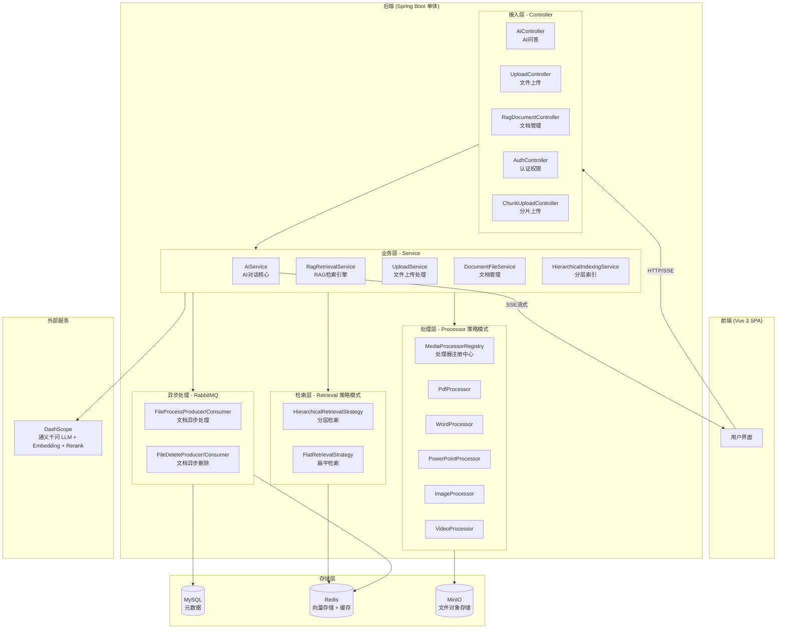
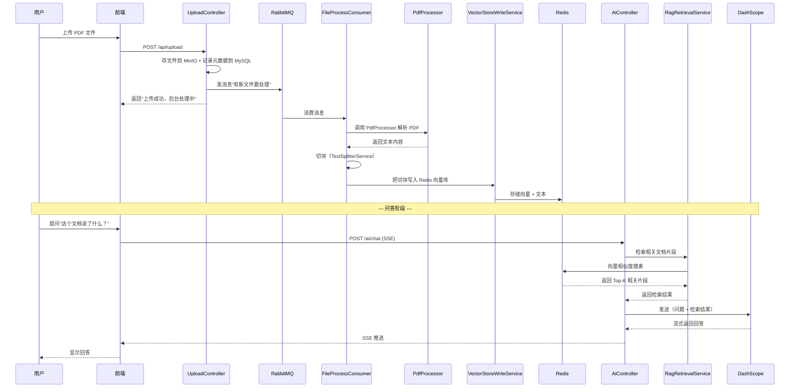

# 全局鸟瞰 — 项目架构导读

## 一句话概括

这是一个**企业级 RAG 知识库系统**——用户上传文档（PDF/Word/PPT/Excel/图片/视频），系统自动解析、切块、向量化存储，然后用户可以用自然语言提问，AI 会从文档中检索相关内容并生成回答。

---

## 业务背景（先懂业务再看代码）

想象你公司有大量文档（产品手册、技术文档、会议纪要等），员工想找某个信息时得翻半天。这个系统做的事就是：**把文档喂给 AI，让 AI 帮你"读懂"所有文档，然后你问什么它都能从文档里找答案**。

核心场景：
1. **上传文档** → 系统自动解析、切块、存入向量数据库
2. **AI 问答** → 用户提问 → 系统检索相关文档片段 → AI 生成回答
3. **权限管理** → 不同角色看到不同文档

---

## 项目全景图

---

## 技术栈速览

| 维度 | 技术选型 | 大白话解释 |
|------|---------|-----------|
| 语言 | Java 17 | 后端用 Java 写的 |
| 框架 | Spring Boot 3.3.5 | Java 最流行的 Web 框架，帮你自动配置好大部分东西 |
| 前端 | Vue 3 + Vite | 现代前端框架，页面是单页应用（SPA） |
| ORM | MyBatis-Plus 3.5.7 | 简化数据库操作的工具，不用手写 SQL |
| 数据库 | MySQL | 存文档元数据、用户信息等结构化数据 |
| 向量存储 | Redis（RediSearch 模块） | 存文档的向量表示，用于语义搜索 |
| 对象存储 | MinIO | 存上传的原始文件（类似私有版 S3） |
| 消息队列 | RabbitMQ | 异步处理文档（上传后后台慢慢解析，不阻塞用户） |
| AI 模型 | DashScope（通义千问） | 阿里云的大模型服务，提供 LLM + Embedding + Rerank |
| 认证 | Sa-Token | 轻量级 Java 权限框架，管理登录和权限 |
| 限流 | 自定义 + Redis | 防止接口被刷，基于 IP 限流 |

---

## 核心模块一览（按重要性排序）

| 模块 | 职责（一句话） | 类比 | 优先级 |
|------|--------------|------|--------|
| **RagRetrievalService** | 用户提问时，从向量库检索最相关的文档片段 | 图书馆的"智能检索员" | ⭐⭐⭐ 必看 |
| **AiService** | 调用大模型，把检索结果+用户问题发给 AI 生成回答 | 餐厅的"大厨"，把食材做成菜 | ⭐⭐⭐ 必看 |
| **UploadService + Processor** | 接收文件，调用不同处理器解析各种格式 | 快递分拣中心，不同包裹走不同通道 | ⭐⭐⭐ 必看 |
| **HierarchicalIndexingService** | 把文档切成层级结构（文档→章节→段落），做分层索引 | 书的目录结构 | ⭐⭐ 建议看 |
| **VectorStoreConfig** | 配置 Redis 向量存储（leaf + summary 两个索引） | 图书馆的两个书架（细粒度 + 摘要） | ⭐⭐ 建议看 |
| **FileProcessConsumer** | 监听 RabbitMQ，异步处理文档解析和向量化 | 后台工人，默默干活 | ⭐⭐ 建议看 |
| **AuthController + Sa-Token** | 登录、注册、权限校验 | 门卫 + 通行证 | ⭐ 用到再看 |
| **SummaryWindowChatMemory** | 管理 AI 对话的上下文记忆（滑动窗口+压缩摘要） | AI 的"短期记忆" | ⭐ 用到再看 |

---

## 数据怎么流转（文档上传 → AI 问答）

> 场景：用户上传一份 PDF，然后问"这个文档说了什么？"

---

## 新手生存指南

1. **先跑起来再说** — `mvn spring-boot:run` 启动后端，`cd frontend && npm run dev` 启动前端，访问 `localhost:5173` 看效果
2. **配置文件是关键** — `src/main/resources/application.yaml` 里有所有中间件的连接信息，跑不起来大概率是这里没配对
3. **RabbitMQ 必须先启动** — 文档处理是异步的，没有 RabbitMQ 上传的文档不会被解析
4. **Redis 要带 RediSearch 模块** — 普通 Redis 不支持向量搜索，需要用 `redis/redis-stack` 镜像

---

## 推荐阅读顺序

| 顺序 | 文件/目录 | 为什么先看它 | 预计耗时 |
|------|----------|-------------|---------|
| 1 | `application.yaml` | 了解系统依赖和配置 | ~10min |
| 2 | `Controller/AiController.java` | AI 问答的入口，核心业务 | ~10min |
| 3 | `service/AiService.java` | AI 对话的核心逻辑 | ~15min |
| 4 | `service/RagRetrievalService.java` | RAG 检索引擎，理解怎么"找答案" | ~15min |
| 5 | `service/processor/` 目录 | 理解文档是怎么被解析的 | ~20min |

---

## 动手试试

试着找到 AI 问答的入口：打开 `src/main/java/com/example/demo/Controller/AiController.java`，看看 `/ai/chat` 接口调用了哪些下游服务，画出你理解的调用链。

---

**验证理解**：你能用自己的话说说，一个用户上传 PDF 到得到 AI 回答，数据经过了哪几个"站点"吗？（不用精确，大概说对就行）

**下一步你想：**
1. **深入某个模块** — 比如 RAG 检索引擎是怎么工作的？文档切块策略是什么？
2. **追踪一条具体链路** — 比如从 `/ai/chat` 接口开始，一步步跟踪完整调用链
3. **了解怎么加新功能** — 比如想支持一种新文档格式，该改哪里？